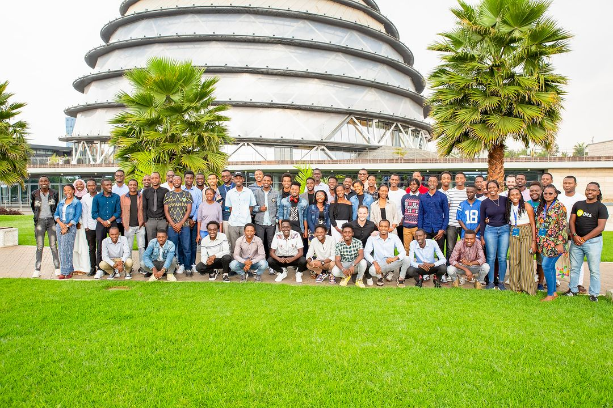

# Peer Learning Repository
---
> If you want to go fast go alone. If you want to go far, go together.

## About

This repository was created to aid myself and others who would like to go farther in the ALX software engineering program. we are not there yet but as we journey together we are going far and we would become one of the best software engineers in the world.

---
### Collaborators

The collaborators to this repository are;
- [Azeeez](https://github.com/hertheyhermee)
- [Kimberly](https://github.com/KimberlyPeters)
- [Church](https://github.com/Hintrovert)
- [Esther](https://github.com/Mugush)
- [Loice](https://github.com/lwafulah)
- [paraclete](https://github.com/Paraclete12)
- And Yours Truly, [MYSELF](https://github.com/ConquerorCletus)

---
#### Contact information
+ Email:Conquerordevs@gmail.com

    Let's Work Together to make the World a Better place.
